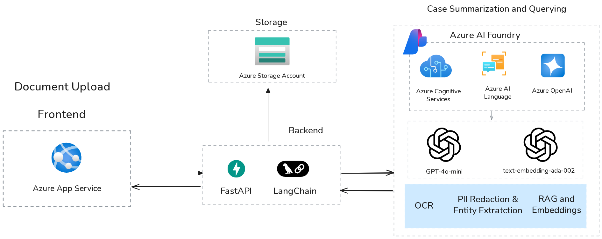
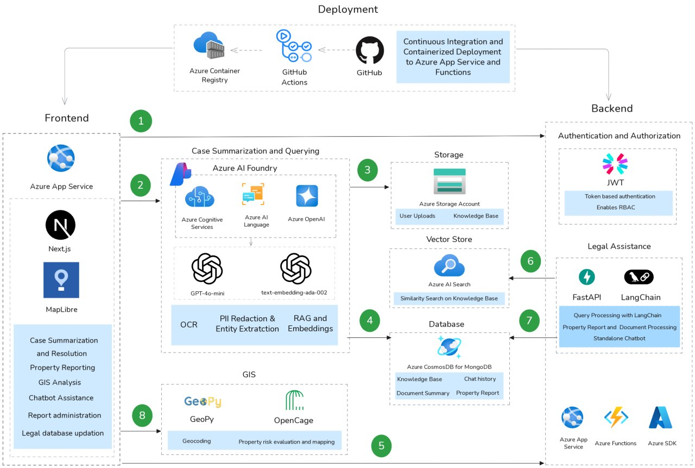
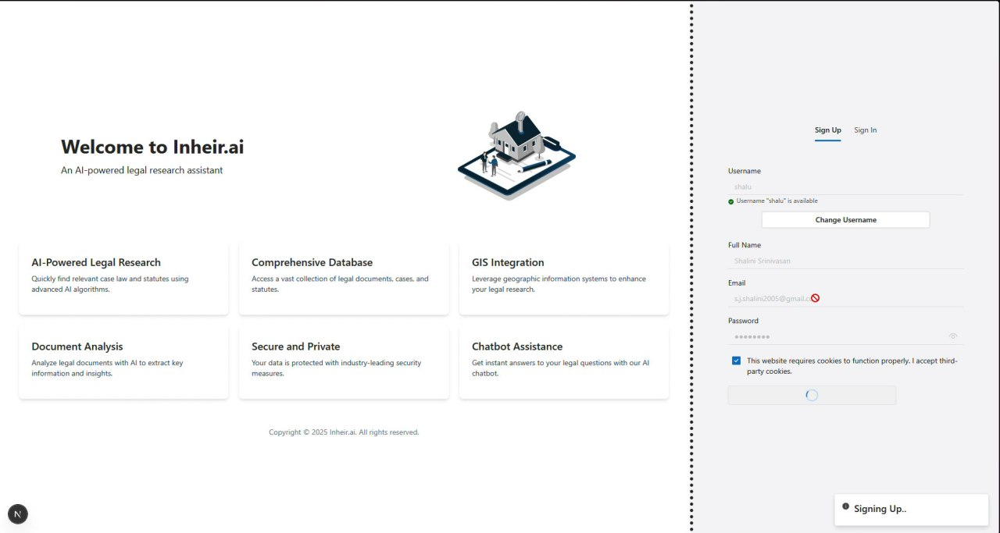
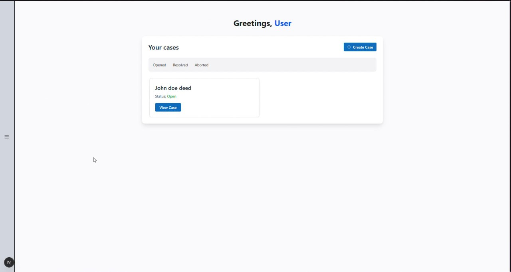
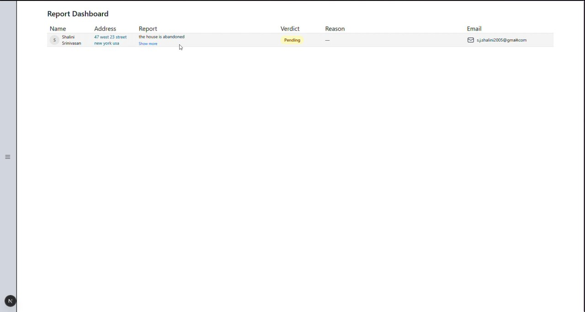
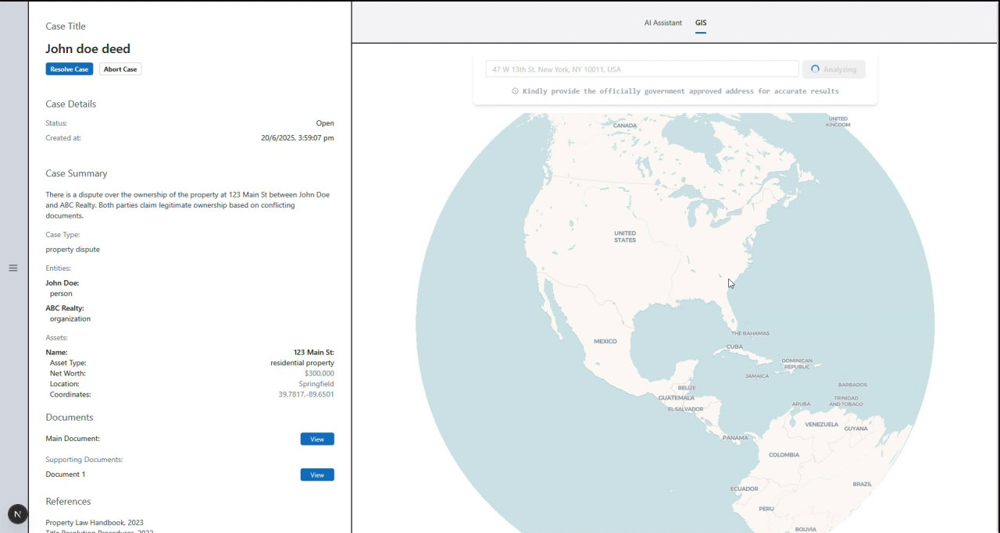
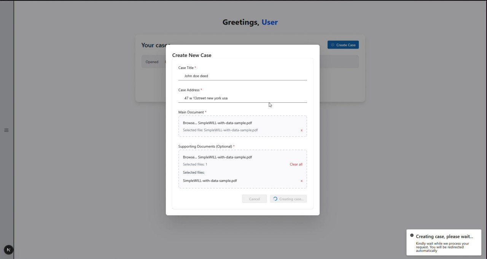
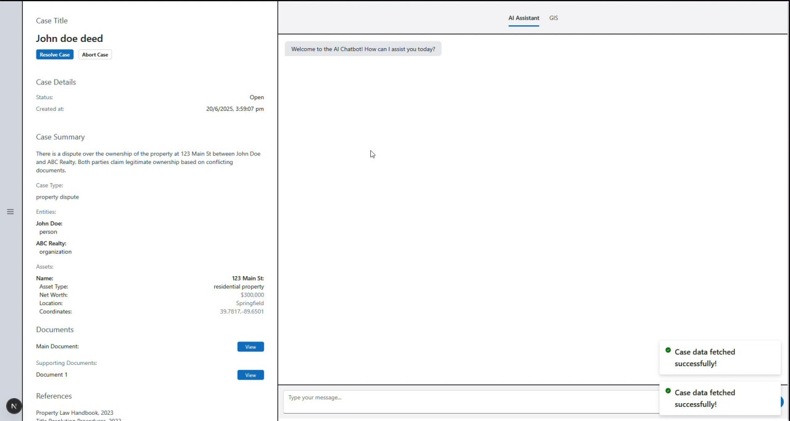
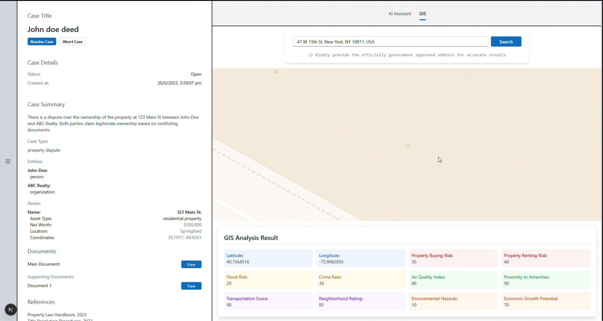

<div align=center>
    
     &nbsp;&nbsp;&nbsp;&nbsp;&nbsp;&nbsp;&nbsp;&nbsp;&nbsp;&nbsp;
    
    <h1>Innovation Challenge June 2025</h1>
    
    
    
    <h1>InHeir.AI: Smart and secure property dispute management, at your fingertips</h1>
    <a href="./assets/presentation.pdf"> 
    </a>
    &nbsp;&nbsp;&nbsp;
    <a href="https://drive.google.com/file/d/1TeurL_8IhTP7NU4HaM5lDo5WN9H-2zNO/view?usp=sharing">
        
    </a>
    &nbsp;&nbsp;&nbsp;
    <a href="https://inheir.plumespaces.com/">
        
    </a>
</div>

InHeir.AI is an intelligent and secure legal tech platform developed to streamline property dispute management and analysis legal professionals and local communities. By harnessing the capabilities of large language models (LLMs) and principles of privacy, the solution stands to ensuring data privacy, security and accuracy by adhering to responsible AI practices while ensuring responses are backed by established legal procedures. InHeir.AI aims to serve globalized requirements by providing a modular platform that can support tailored and updated legal establishments for catering to different needs beyond legal institutions.

# Table of Contents

1. [**Overview**](#overview)  
2. [**Why?**](#why)  
3. [**Design**](#design)  
4. [**Features**](#features)  
   - [Case Creation and Management](#case-creation-and-management)  
   - [Geo-spatial Visualization](#geo-spatial-visualization)  
   - [Integration with Knowledge Base](#integration-with-knowledge-base)  
   - [Standalone Chatbot](#standalone-chatbot)  
   - [Property Reporting and Management](#property-reporting-and-management)  
5. [**Working**](#working)  
   - [Document Summarization](#document-summarization)  
   - [Geographical Information System (GIS) Analysis](#geographical-information-system-gis-analysis)  
   - [Integrated Knowledge Base](#integrated-knowledge-base)  
   - [Modular, Contextual Chatbot](#modular-contextual-chatbot)  
   - [Property Reporting](#property-reporting)  
   - [Security](#security)  
6. [**Architecture**](#architecture)  
7. [**Technologies Used**](#technologies-used)  
8. [**Screenshots**](#screenshots)  
9. [**Challenges**](#challenges)  
10. [**Impact**](#impact)  
11. [**Future Enhancements**](#future-enhancements)  
12. [**Proposal**](#proposal)  
13. [**Contributing**](#contributing)  
14. [**Deployment**](#deployment)  
15. [**Try**](#try)  
16. [**Licensing**](#licensing)


## Why?

- **Cumbersome and expensive legal processes** resulting in vulnerable population losing accessibility to legal procedures, inherently causing them to lose their titles and properties.

- **Inadequate support for policy comprehension** making legal policies harder to understand and leverage for less legally-aware citizens.

- **Lack of means for reporting of vulnerable properties** via crowdsourcing, resulting in lack of usable external data for property risk analysis.

- **Absence of privacy-friendly, compliant system** for the same, resulting in non-adherence to global regulations by usage of LLMs due to sensitive information.

# Design

## User-centric design
The core aspect of InHeir.AI is to be usable, clear, and accessible for end-users of all technical backgrounds for inclusiveness, which is achieved by user-centric design and interaction with user interface (UI), striking a balance in aesthetics and usability.

## Modularity and comprehensive AI

The system is to be adaptable for different legal requirements and policies for improved global adoption. The system also aims to be comprehensive by handling different kinda of data using external knowledge base.

## Responsible AI

InHeir.AI aims to be transparent, accessible, fair and privacy-preserving by adhering to Responsible AI practices to ensure marginalized communities are catered to without discrimination, all without having to trade privacy for convenience.

## Streamlined Data Management

InHeir.AI aims to be a comprehensive platform for managing cases and property risk reports and providing relevant information by looking up on custom external knowledge base and data sources, providing geospatial insights and visualizations, aiming to be a hub for knowledge sharing to make property risk mapping more comprehensive in addition to publicly available data.

## Security and Compliance

InHeir.AI is designed to be secure by design in order to maintain compliance with regulatory requirements on protection and usage of private data, empowering legal professionals to handle cases in a smart and efficient manner without sacrificing security by leveraging role-based access control. The system's meant to be deployed for own needs in order to have control over data processing.

## Collaboration and Transparency

InHeir.AI's ultimate aim is to accelerate communities working in addressing property disputes, and one way to achieve it is by providing aggregated, synthesized data of property risk extracted from users of the platform for research and analysis, aiding in comprehensive dataset, serving as a single source of truth.

# Features

## Case creation and management

Users can create a new case by uploading their property documents (will, deed, probate) along with optional supporting documents (tax files, letters, etc.) processed by [document summarization](#document-summarization) and ownership chaining for extraction of summary of data, containing information such as:

- Entities involved
- Properties mentioned
- Summary
- Type of case
- References
- Recommendations

for resolution of case by providing the above information in simple terms for understanding by common people. This is all done without sacrificing user's privacy or providing biased information by usage of grounded truths posed by generic laws.

## Geo-spatial visualization

It is possible to visualize a physical address on a 3-D map with property risk information, which is useful for identifying if a property is blighted, at-risk, etc. For information on how this works, refer to [GIS Analysis](#geographical-information-system-gis-analysis)

## Integration with Knowledge Base

InHeir.AI is designed to give grounded, factual, updated legal assistance and one way to ensure the responses are consistent and coherent. The system's to be provided with files on property laws on different countries (or specific if tailored towards citizens of specific demographic and nationality) for improved comprehension and accuracy in responses. For information on how this works, refer to [integrated knowledge base](#integrated-knowledge-base)

## Standalone chatbot

Primarily several users would like to interact with a chatbot in independent manner from case. Despite creating and getting summary for the case, a user could still have some doubts. This can be clarified by leveraging the standalone chatbot which is responsible for performing RAG on property laws and on context and answering user's queries pertaining to the case and independent of it.

For information on how this works, refer to [working of chatbot](#modular-contextual-chatbot)

## Property reporting and management

Users can report on properties that have been abandoned, blighted, been tax delinquent, etc. which is a useful way for organizations to gather data regarding potentially vulnerable properties, something that was exhaustive and less comprehensive in the earlier days due to lack of proper outreach mechanisms.
For information on how this works, refer to [property reporting](#property-reporting)

# Working

## Document Summarization



1. When a user uploads any document (primary or supporting document), the textual content of it is extracted via OCR after being written to Azure Blob Storage. This is done by Azure Document Intelligence.
2. The textual content retrieved via Document Intelligence is passed to Azure AI Language for PII redaction and entity extraction for ownership chain modelling.
3. The extracted entities are stored in a key map for temporary use case and query is made by usage of redacted text to ensure data's clean of sensitive information, which yields information based on the mapped anonymous entity. Let's say, an anonymized entity named ENTITY_1 is mapped to name John Doe, which means responses generated via LLM contains ENTITY_1. This is substituted back again on the server to send intelligible response to the client.
4. The entities are stored in MongoDB with CSFLE (Client-side field-level encryption) to ensure entries are not accessible while at rest.
5. The summary is provided to the user which is displayed in the dashboard.

## Geographical Information System (GIS) Analysis

1. When a user enters an address, it is sent to the backend for processing, where the address gets geocoded using geopy library's supported backend: OpenCage which can be freely accessed by an API key.
2. The system then retrieves the coordinates in an accurate manner for the address and starts evaluating the property's attributes using OpenAI for web based access and public datasets available for Georgia by [census.gov](https://census.gov) and [DOCP's data](https://dpcd-coaplangis.opendata.arcgis.com/datasets/coaplangis::official-neighborhoods-with-current-demographic-data-2024/explore?showTable=true) is used in the flagship instance.
3. Then the response with the following properties are returned along with the coordinates for the frontend's visualization by marker.
- Property Buying Risk
- Property Renting Risk
- Flood Risk
- Crime Rate
- Air Quality Index
- Proximity to Amenities
- Transportation Score
- Neighbourhood Rating
- Environmental Hazards
- Economic Growth Potential
4. The frontend displays the map which is due to MapLibre library available for the web

## Integrated knowledge base

1. The property law documents are provided for indexing by Azure AI Search. The documents get uploaded to Azure Blob Storage, where Azure Document Intelligence is used for extracting text pertaining to the uploaded property law files.
2. This is uploaded to another container in Azure Storage Account. This is indexed in hourly manner via Azure AI Search using an indexer, which adds the content to the vector storage along with generated embeddings by text-embedding-ada-002 for easier querying.
3. This content is retrieved by the chatbot by RAG with Azure OpenAI's GPT-4o-mini for providing legal assistance and the content can be updated for ensuring up-to-date relevant information in responses.

## Modular, contextual chatbot

1. When a query is made to a particular case, the information regarding the case is retrieved from the database. This is passed as a context along with the search results obtained upon RAG on property laws using Azure AI Search.
2. The result is retrieved by usage of chunked responses for efficiency via LangChain.
3. The processed results is sent to the client back.
4. The component can also be deployed independently using Azure Functions, which will help in integration of legal assistance into other platforms than InHeir.AI.

## Property Reporting

1. A user can submit a property report anonymously or with contact details with address of property and reason for reporting.
2. The reports are viewed by administrators (one with 'Admin' role) who can mark it as verified or not verified upon outreach to the reporter's contact details (if provided) or by other mechanisms.
3. The verified reports are processed and stored in database with geocoded coordinates for integration with other data pipelines.

## Security

1. InHeir.AI ensures data is cleaned on an automatic manner by usage of Azure Functions for deletion of files from anonymous users in 24 hour window period.
2. InHeir.AI uses CSFLE in production done to secure PII entries from being used with AI agents.
3. InHeir.AI provides role-based access control, allowing data boundaries to exist without impeding collaboration.

# Architecture



InHeir.AI follows a hybrid approach towards API architecture in the sense it supports both server and serverless operations for efficient request processing.

# Technologies Used

- **Frontend:**
  - **Next.js** for frontend framework.
  - **Fluent UI React** for consistent and accessible UI components.
  - **MapLibre** for geospatial visualization of property risk data (GIS Integration).

- **Backend:**
  - **FastAPI** for API server with automatic OpenAPI integration, allowing integration in data pipelines or usage via API management services like Azure Front Door for scalable access.
  - **LangChain** for contextual prompt evaluation using Azure OpenAI for structured and reliable prompt responses.
  - **Azure Functions** for serverless, scalable, cost-effective computation, required for standalone chatbot and data cleaning for maintaining independence from main API.
  - **Azure CosmosDB for MongoDB** for storage of unstructured data, ready for processing with external data pipelines, for aggregated property risk data.
  - **OpenCage** for geocoding physical addresses to estimate latitude and longitude.
  - **Azure SDK for Python** for interaction with several  deployed Azure services for functionality of the application.

- **Azure:**
  - **Azure AI Foundry** for management of Azure AI Services such as Azure OpenAI (text-embedding-ada-002 for embeddings and GPT-4o-mini for chat completions), Azure AI Language
  - **Azure AI Search** for vector storage of property law documents with embeddings for querying via the chatbot for grounded legal assistance with cases.
  - **Azure Container Registry** for storage of container images (Docker) for continuous deployment with GitHub Actions to Azure App Service and Azure Functions.
  - **Azure App Service** for containerized, scalable and reliable deployment of web services and management of API server.

# Screenshots
| InHeir.AI Screenshots |
| --- |
|  |


| Home Page | User Dashboard |
| --- | --- |
|  |  |
| Report Dashboard | Report Creation Form |
|  |  |
| Case Page | Case Creation Form |
|  |  |
| Chatbot Feature | GIS Feature |
|  |  |

# Challenges

1. Ensuring quality of responses when redacted text is used after processing with Azure AI Language.
2. Computational complexity in PII substitution resulting in performance overhead.
3. Performance issues while using CSFLE in MongoDB, resulting in poor user experience for user-facing applications.
4. Technical challenges in retrieval of information from documents in structured manner, requiring trained models for different forms.
5. Accuracy in GIS due to lack of comprehensive dataset and complexity involved in training models.
6. Improper handling of non-form or non-computer generated PDFs which will need usage of Azure Custom Vision for more tailored training on property form fields for accurate extraction.

# Impact

1. **Improved policy comprehension** among marginalized or underrepresented sections of society allowing legal awareness regarding their rights around inheritance of property and titles.
2. **Reduced property and title disputes** due to accessible platform and improved awareness among the general public reducing overhead on legal administrators.
3. **Improved analysis of property risks** by crowdsourcing data from community people, allowing comprehensive coverage of open data, aiding in enhancement of Census API.
4. **Reduced privacy breach** due to redaction of information, allowing accelerated legal adoption of InHeir.AI.

# Future Enhancements

1. Implement support and enhance accuracy for scanned documents of low quality for providing comprehensive document summarization.
2. Training of custom models for field based extraction for structured processing and improved accuracy.
3. Implementing data pipelines for processing verified property risk reports for easier integration by other organizations.
4. Enhance the quality of self-hosting for organizations to have control over data processing.
5. Gather anonymous, aggregated analytical data to understand property dispute patterns and trends.

# Proposal

We aim to develop custom models that could be used for recognition of data from property forms by improving existing Azure models for text recognition and extraction, which could be used in Document Intelligence and Azure Custom Vision alike, enabling globalized and accurate data extraction for legal documents.

# Contributing

We welcome contributions, expecially for improving our data recognition and extraction from different property forms across different countries. Your contribution will make InHeir.AI more accessible for developing nations, without being restricted to systemic biases due to responsible AI principles, thus making the system more accessible, transparent and fair for usage.

For contributing code or documentation, check below:

## Development
InHeir.AI is structured via submodules, organized as follows:

- **Frontend:** Built using Next.js for dynamic user experience and visualizations using MapLibre.
- **Backend:** RESTful APIs developed with Python and FastAPI with code for Azure Function Apps.

### Prerequisites

- Docker and Docker Compose for containerized development

### Steps to Run Locally

- Verify Docker and Docker Compose are installed:

``` sh
docker -v
docker compose version
```

- Clone the repository and set up environment variables as per the `.env.sample` for the frontend and backend.

``` sh
git clone --recurse-submodules https://github.com/grittypuffy/inheir.ai
cd inheir.ai

cp frontend/.env.sample frontend/.env
cp backend/.env.sample backend/.env
```

- Build the services as mentioned in the corresponding repositories. For more information regarding local development, check out the README for [frontend](https://github.com/vg006/inheir-frontend) and [backend](https://github.com/grittypuffy/inheir-backend)

# Deployment

For information regarding deployment of InHeir.AI on Azure, please check out [our guide](./deployment/README.md) for it which covers dependencies, process and troubleshooting.

# Try

We have a demo running at https://inheir.plumespaces.com

To access as an administrator to test the dashboard for property reports, use these credentials:

username: admin
password: admin

# Team

- **Keerthana Rajesh Kumar**:
    - [GitHub](https://github.com/grittypuffy)
    - [LinkedIn](https://linkedin.com/in/keerthana304)
- **Shalini Srinivasan**:
    - [GitHub](https://github.com/ShaliniSJ)
    - [LinkedIn](https://linkedin.com/in/sjshalinisrinivasan/)
- **Vijay Ganesh S**:
    - [GitHub](https://github.com/vg006)
    - [LinkedIn](https://linkedin.com/in/vijayganeshs2006/)

## Licensing

InHeir.AI is licensed under the MIT License, thus allowing permissive usage for your needs.

For more information, check the [LICENSE](/LICENSE) file.
